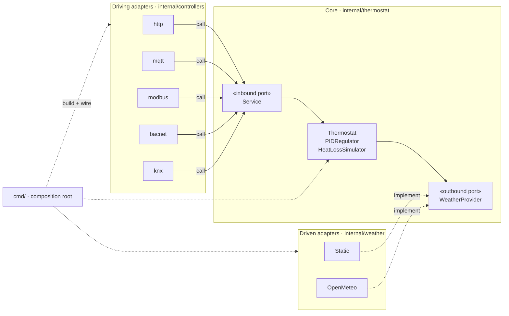

# Contributing to Thermocktat

Thanks for your interest in improving Thermocktat! This document covers everything you need to build, run, and test the project locally, and how to submit issues and pull requests.

Thermocktat is implemented in Go and open source. It is a thermostat emulator made of one main thermostat application (`internal/thermostat`) exposed through several controllers (`http`, `mqtt`, `modbus`, `bacnet`, `knx`) in `internal/controllers`. The `cmd` directory contains the code to configure and run it.

## Prerequisites

- [Go](https://go.dev/dl/) 1.25 or newer (see `go.mod`).
- [Docker](https://docs.docker.com/get-docker/) — to build/run the image and for some integration tests.
- [uv](https://docs.astral.sh/uv/) — for the Python integration tests.

## Building from source

```sh
mkdir -p .bin
CGO_ENABLED=0 go build -o .bin/thermocktat ./cmd/thermocktat
```

## Running locally

Run directly with the Go toolchain:

```sh
TMK_CONTROLLER=http \
TMK_ADDR=:8080 \
go run ./cmd/thermocktat
```

Or run the compiled binary with a config file:

```sh
go build -o thermocktat ./cmd/thermocktat
./thermocktat -config config.yaml
```

Configuration can be provided three ways, in order of increasing priority: the embedded defaults (`cmd/app/config_defaults.yaml`), a `config.yaml` file passed with `-config`, and `TMK_`-prefixed environment variables (top priority). See `cmd/app/config.go` and the [Configuration section of the README](README.md#configuration).

## Tests

### Unit tests

```sh
go test -race ./...
```

### Integration tests

The `integration/` directory is a separate Python project (uv + pytest) that tests each controller protocol end-to-end against a built binary.

```sh
cd integration
uv sync
uv run pytest
```

Some tests require external services: an MQTT broker for `test_mqtt_control.py`, and Docker for `test_bacnet_control.py`.

## Code quality

All quality checks are enforced in CI; please run them locally before opening a PR.

### Go

- `gofmt -w .` — formatting
- `goimports -w .` — import ordering
- `go vet ./...` — static analysis
- `gopls check` — linting

### Python (integration tests)

- `ruff check .` — linting
- `ruff format --check .` — formatting
- `ty check` — type checking

## Architecture

Thermocktat follows a **ports & adapters (hexagonal)** layout. The core (`internal/thermostat`) holds the domain — the `Thermostat` with its `PIDRegulator` and `HeatLossSimulator` — and *owns both of its ports* (`internal/thermostat/port.go`):

- **`Service`** — the inbound (driving) port: the control API the controllers call.
- **`WeatherProvider`** — the outbound (driven) port: the outdoor temperature the heat-loss simulation needs.

Dependencies point inward — adapters depend on the core, never the reverse:

- **Driving adapters** (`internal/controllers/*`: http, mqtt, modbus, bacnet, knx) take a `thermostat.Service`; they never see the concrete `*Thermostat`.
- **Driven adapters** (`internal/weather`: `Static`, `OpenMeteo`) implement `thermostat.WeatherProvider`.
- **`cmd/`** is the composition root: it builds the concrete thermostat and adapters and wires them together.

This is the key decoupling boundary — keep new controllers behind `thermostat.Service`, and new outdoor-temperature sources behind `thermostat.WeatherProvider`. Test at those seams (see `internal/testutil` for the shared fakes).



The app is distributed as a Docker image (see `Dockerfile`) and must stay lightweight: we want to run 100+ instances on a single machine to simulate a real building. Be mindful of image size and resource usage in changes.

## CI/CD

Two GitHub Actions workflows handle CI and releases separately.

### CI (`.github/workflows/ci.yaml`)

Runs on PRs (and `workflow_dispatch`). Main is protected — all changes go through PRs.

```
test-lint-build ──→ integration-tests ──┐
                                        ├──→ docker-push
docker-build ──→ docker-scan ───────────┘
```

- **test-lint-build**: Go quality checks (gofmt, goimports, go vet, gopls), unit tests with coverage, binary build.
- **docker-build**: Builds `linux/amd64` and `linux/arm64` images in parallel, uploads as artifacts.
- **docker-scan**: Runs [Trivy](https://github.com/aquasecurity/trivy) vulnerability scan on the built image. Fails on CRITICAL/HIGH CVEs.
- **integration-tests**: Python (pytest) end-to-end tests for each controller protocol.
- **docker-push**: After all checks pass, pushes the validated images to `ghcr.io` tagged with the PR number (e.g., `:pr-42`).

### Release (`.github/workflows/release.yaml`)

Runs on tag pushes. Finds the merged PR for the tagged commit, retags its `:pr-N` image with the version and `latest` — no rebuild. Signs the image with [cosign](https://github.com/sigstore/cosign) (keyless) and creates a GitHub Release with an auto-generated changelog.

### Releasing

```sh
git tag v0.7.0
git push origin v0.7.0
```

The release workflow finds the merged PR for that commit, locates the corresponding `:pr-N` image, retags it, signs it, and creates the GitHub Release.

## Submitting an issue

Before opening an issue, please search existing issues to avoid duplicates. A good bug report includes:

- what you expected to happen and what actually happened;
- steps to reproduce, including the controller and configuration (`config.yaml` and/or `TMK_` env vars) used;
- relevant logs and the Thermocktat version or commit.

For feature requests, describe the use case (especially the BMS testing scenario) rather than just the proposed solution.

## Submitting a pull request

1. Fork the repository and create a topic branch from `main`.
2. Make your change, keeping it focused — one logical change per PR.
3. Add or update tests. We aim for close to 100% coverage; favor acceptance/specification-level tests, and don't test private implementation details.
4. Run the full quality suite locally (formatting, linting, vetting, unit and integration tests) — see [Code quality](#code-quality) and [Tests](#tests).
5. Update documentation (this file, the README, or the controller READMEs under `internal/controllers/`) when behavior or configuration changes.
6. Open the PR against `main` with a clear description of what changed and why. CI must pass before review.

By contributing, you agree that your contributions are licensed under the project's [MIT License](LICENSE).
