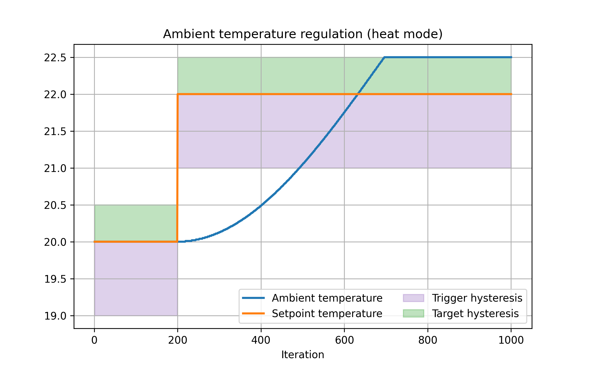

# Thermocktat

A lightweight thermostat emulator, primarily designed for BMS software testing (Building Management Systems).

<p align="center">
  
</p>


## Attributes

| Name           | Type    | Default   | Comment                                      |
|----------------|---------|-----------|----------------------------------------------|
| ambient_temperature    | float   | 21.0      | Current temperature reading.      |
| setpoint_temperature  | float   | 22.0      | Target temperature. Must be between `setpoint_temperature_min` and `setpoint_temperature_max`. |
| mode           | string  | "auto"    | Operating mode: `auto \| heat \| cool \| fan`. |
| fan_speed      | string  | "medium"  | Fan speed setting: `auto \| low \| medium \| high`.  |
| enabled          | boolean | true      | Indicates if the thermostat is powered (on/off).   |
| setpoint_temperature_min  | float   | 16.0      | `setpoint` lower bound.    |
| setpoint_temperature_max  | float   | 28.0      | `setpoint` upper bound.   |


## Regulation - ambient temperature simulation

The regulation of ambient temperature is simulated using a [PID regulator](https://en.wikipedia.org/wiki/Proportional%E2%80%93integral%E2%80%93derivative_controller) and hysteresis (see diagram below).


<p align="center">
  
</p>

Regulation simulates the effect of heating or cooling systems controlled by the thermostat that will actually heat and cool the room in order to reach the desired temperature (setpoint).

This example is for the heating mode. If the ambient temperature is above setpoint, or below within a hysteresis range (- `TriggerHysteresis`, 1°C in this example), heating is not triggered. When it is lower with a difference greater than the trigger hysteresis, heating start until the target temperature is reached. The target is the setpoint temperature plus a target hysteresis (0.5°C here).

The reason for having 2 different hysteresis values is to avoid infinite loops in the `auto` mode. Otherwise, reaching target temperature after heating would immediately trigger cooling down to the lower hysteresis bound, which would again trigger heating, and so on. This is why `TargetHysteresis` must always be lower than `TriggerHysteresis`. 

Regulation params can be set in the `config.yaml` file (see `config.example.yaml`). Regulation can also be disabled (in this case, ambient temperature will remain constant).

## API Documentation
- [HTTP Controller API](internal/controllers/http/README.md)
- [MQTT Controller API](internal/controllers/mqtt/README.md)
- [Modbus Controller API](internal/controllers/modbus/README.md)
- [BACnet Controller API](internal/controllers/bacnet/README.md) (Coming soon)


## Configuration

Can dynamically populate initial values and set server configuration with a `config.yaml` file (see `config.example.yaml`).

Usage:
```sh
go run ./cmd/thermocktat -config config.yaml
```

If no config is provided, default values will be used and server will run on port 8080.

Can also run with environment variables (which have priority over config) :
```sh
THERMOCKSTAT_HTTP_ADDR=:3001 go run ./cmd/thermocktat
# or
PORT=3001 go run ./cmd/thermocktat
```

## Docker Examples

```sh
docker run -p 8080:8080 thermocktat
docker run -v $(pwd)/config.yaml:/config.yaml -p 8080:8080 thermocktat -config /config.yaml
```
